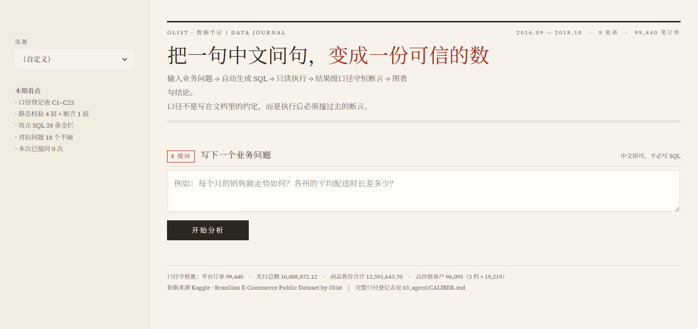
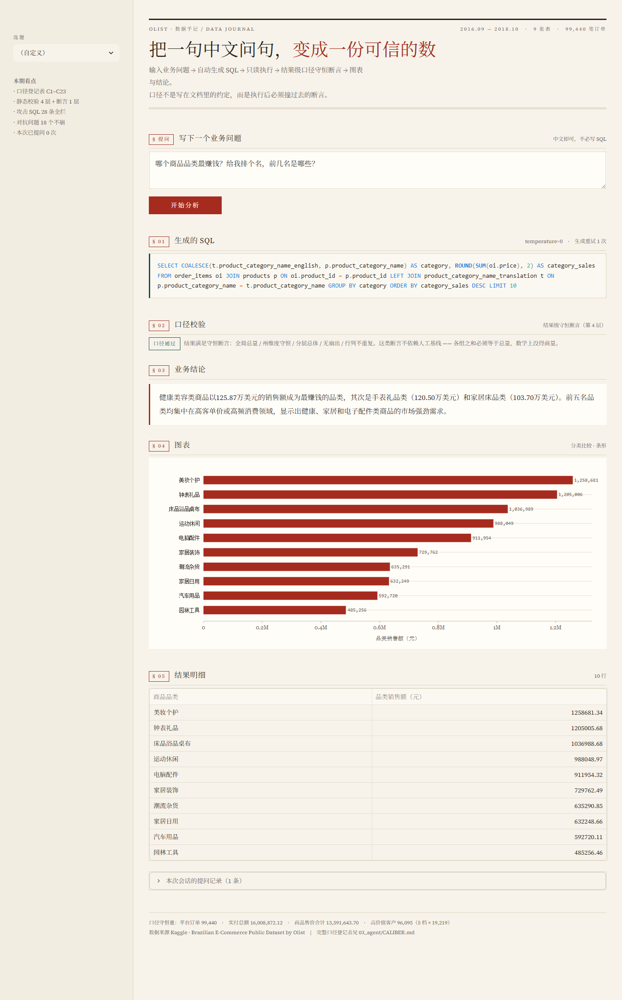
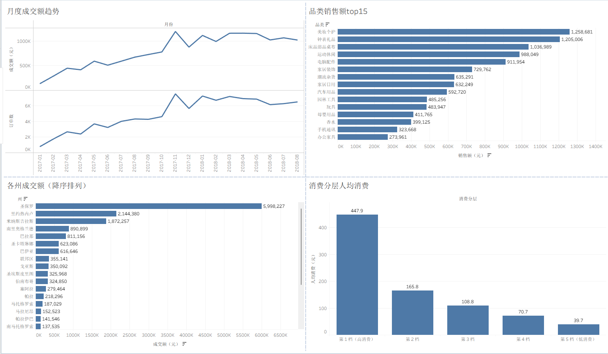
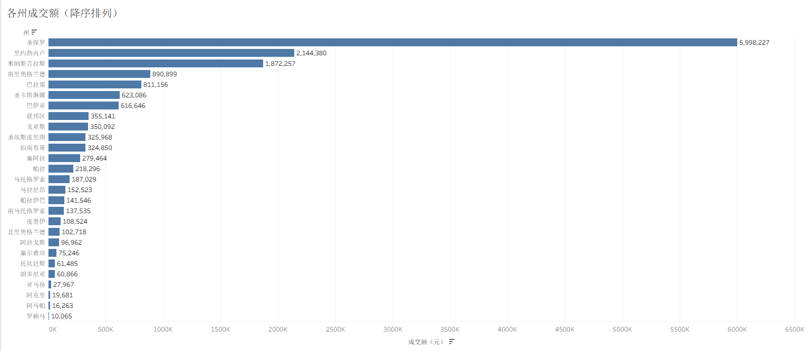
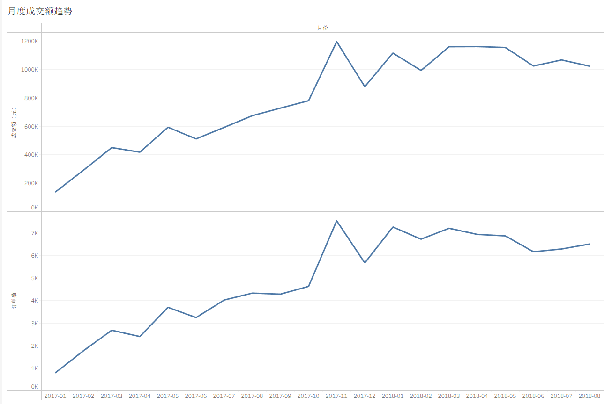
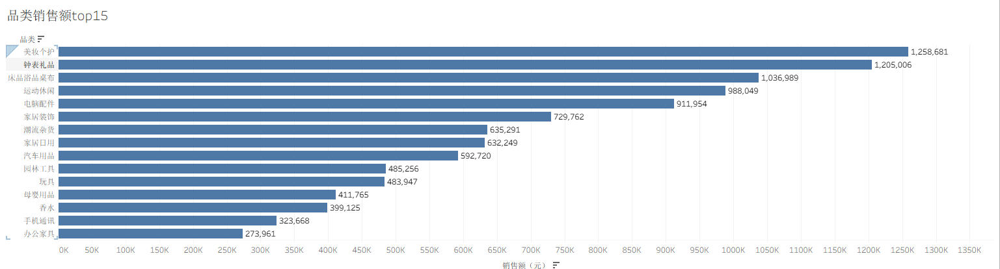
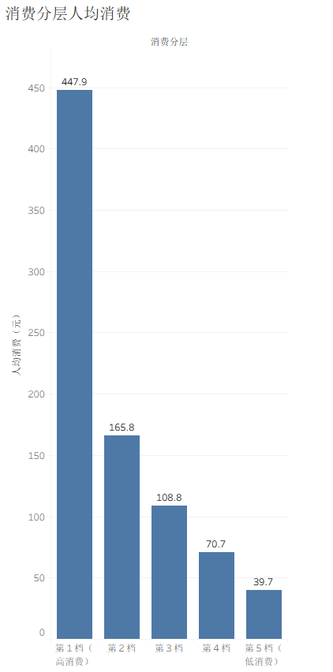
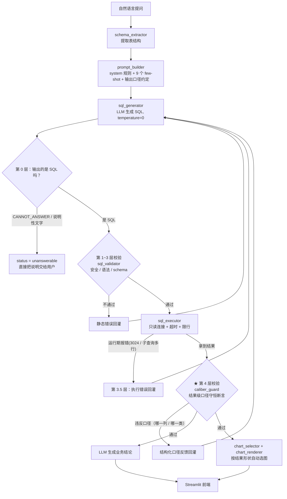

# Olist 电商数据分析 Agent（Text2SQL）


> 用自然语言问业务问题 → Agent 自动生成 SQL → 校验执行 → 出图表 + 业务结论。
> 基于 Kaggle **Brazilian E-Commerce (Olist)** 数据集，MySQL 存储，支持任意 OpenAI 协议大模型。

**三个模型 × 10 道业务题的结果如下：**

| 模型 | 可执行率 | 严格一致率 | 核心一致率 | 口径通过率 |
|------|:---:|:---:|:---:|:---:|
| GLM-4.5-Air | 100% | 60% | **100%** | 100% |
| GLM-4.6V | 100% | 60% | **100%** | 100% |
| DeepSeek-Chat | 100% | **70%** | **100%** | 100% |

> “口径通过率”是本项目自建的第 4 层校验指标：**不依赖人工基线**，
> 只用守恒式判断"结果可不可信"。它和核心一致率互补 ——
> 核心一致率是"和基线比"，口径通过率是"和口径守恒式比"。

---

## 界面预览

提问 → 生成 SQL → **第 4 层口径校验** → 自动选图 + 业务结论：





界面用的是浅色排版：暖白背景、深色正文、朱砂红作唯一强调色，标题衬线、数字等宽，
章节用 § 01 / § 02 编号和细分割线分区。图表样式集中在 `04_visualization/chart_renderer.py`；
列名和取值做了中文化（`04_visualization/labels.py`，覆盖 27 个州、71 个商品品类、
订单状态、支付方式、消费分层等）。不想启动 Streamlit 的话，直接打开
`04_visualization/sample_charts.html` 也能看全部图表。

> 结果页 § 02 有一行 `口径通过 · 结果满足守恒断言：全局总量 / 州维度守恒 / 分层总体 / 无扇出 / 行列不重复`，
> 这是第 4 层校验 (`03_agent/caliber_guard.py`) 给出的结论。如果断言不通过，这一行会变成
> 朱砂色告警，并列出具体违反了哪条口径，而不是照样输出结论。

---

## BI 看板（Tableau）

同一份口径登记表也支撑固定看板：`06_bi/make_bi_exports.py` 产出 4 张预聚合宽表，
Tableau 直接连 CSV 出图，**不需要再写任何 SQL**。



四张工作表各自对应一张宽表：

| 工作表 | 数据源 | 核对点（与 `CALIBER.md` 一致） |
|---|---|---|
| 各州成交额（降序） | `dim_state.csv` | 圣保罗 5,998,227；27 州合计 = 16,008,872 |
| 月度成交额趋势 | `fct_monthly.csv` | 只画 20 个完整月（2017-01 ~ 2018-08），末月 1,022,425 |
| 品类销售额 Top 15 | `dim_category.csv` | 首名美妆个护 1,258,681；Top 15 占全网 76.29% |
| 消费分层人均消费 | `dim_customer_segment.csv` | 447.9 / 165.8 / 108.8 / 70.7 / 39.7，各档均 19,219 人 |









> BI 层最容易出错的一处是比值指标：筛选之后想看总客单价，`AVG([客单价（元）])` 是错的
> （各州订单量不同，平均的平均 ≠ 总体比值），必须建计算字段 `SUM([成交额（元）]) / SUM([订单数])`。
> 这条与 Agent 层 C2 是同一条规则 —— 口径治理不只约束 LLM 生成的 SQL，也约束 BI 层的手工计算字段。

---

## 1. 为什么做这个项目

数据分析岗的核心动作是“把业务问题翻译成数据查询”，Text2SQL 是这个动作的自动化。
实践中它的准确率瓶颈通常不在"模型会不会写 SQL"，而在**业务口径没有被显式定义**。

项目重点放在两件事上：

1. **完整可跑通的链路**（不是 demo 片段）：数据入库 → 手写 SQL 基线 → Agent → 自动评估 → 可视化 → 前端。
2. **口径治理 + 可量化评估**：把口径当成 API 契约管理，并用两层一致率指标回归验证，
   从而能回答"改了到底有没有用"。

---

## 2. 架构



> 关键点：静态校验、执行反馈与口径校验**共用同一份重试预算**，模型是"改到对为止"而不是"跑通就交"。
> 第 4 层必须放在执行**之后** —— 扇出、分母错这类错误语法完全合法、`EXPLAIN` 也过，
> 只有拿到结果集才能发现。
> 第 3.5 层的由来：`EXPLAIN` **只解析、不执行**，所以"语法合法但跑不出来"的错误会穿透前三层。
> 第 0 层的由来：模型答不了时给的**自然语言说明**不该被当成"写错的 SQL"去重试。
> （这两层都是**高压测试**压出来的，见 §5 工具化三。）

**目录结构**

```
Dockerfile               # 容器化构建（Python 3.12 + MySQL client）
docker-compose.yml       # 一键启动 MySQL + 应用
.dockerignore            # 构建时排除 .git / .env / __pycache__ 等
01_data/          questions.py            # 10 个业务问题定义
02_sql/           sql_answers.py/.sql     # 手写 SQL 基线（ground truth）
                  baseline_results.json   # 基线执行结果
03_agent/         db.py schema_extractor.py prompt_builder.py sql_generator.py
                  sql_validator.py sql_executor.py agent.py evaluate.py
                  caliber_guard.py        # ★ 第 4 层：结果级口径断言 + 结构化反馈回灌
                  caliber_check.py        # ★ 口径自检工具（扫描五处口径是否一致）
                  stress_test.py          # ★ 高压测试（28 条攻击 SQL + 18 个对抗问题）
                  tests/                  # ★ 回归测试（注入历史真实 bug，共 81 项）
                  CALIBER.md              # ★ 口径登记表（唯一真源）
                  STRESS_REPORT.md        # 高压测试报告
                  model_comparison.md     # ★ 模型对比与评估结论
                  INTERVIEW_NOTES.md      # 面试应答话术
04_visualization/ chart_selector.py     # 按结果形状自动选图
                  chart_renderer.py     # ★ Plotly 渲染（纸面铅印风 + 中文轴）
                  labels.py             # ★ 中文标签层（列名 / 州 / 品类 / 分层）
                  make_sample_charts.py # 生成 sample_charts.html
                  sample_charts.html    # 离线样例图（10 题全部渲染）
05_app/           app.py                  # Streamlit 前端
                  ../.streamlit/config.toml  # Streamlit 主题（与 chart_renderer 同色）
06_bi/            make_bi_exports.py      # 生成 BI 层预聚合宽表（12 条断言：6 守恒 + 2 完整月 + 4 形状）
                  exports/*.csv           # Tableau / Power BI 直接可读的中文宽表
                  README.md               # BI 数据字典 + Tableau 操作说明
docs/screenshots/ 01-landing.png 02-result.png           # Agent 前端截图
                  03~06-bi-*.png 07-bi-dashboard.png     # Tableau 看板截图
```

**BI 层（Tableau）**

Agent 面向探索式提问（结果列与形状不固定），BI 层面向固定看板，两者是上下游关系：
`06_bi/make_bi_exports.py` 按口径把数据预聚合成 4 张宽表（州 / 品类 / 月度 / 客户分层，
含中文列名与取值），Tableau 直接连 CSV 即可出图。宽表口径与 `03_agent/CALIBER.md` 一致，
脚本自带 12 条断言（6 条守恒 + 2 条完整月区间 + 4 条形状），不通过则退出码 1。
数据字典与操作步骤见 `06_bi/README.md`。

口径判断也一并落到字段里，而不是留给看板作者现场发挥。例如 Olist 的采集窗口是
2016-09 ~ 2018-10，首尾月份本就采不满（2016-09 仅 3 单、2018-10 仅 4 单），
`fct_monthly.csv` 因此带一列 `是否完整月`，做趋势图时筛掉首尾即可 —— 
省得每个人各按各的理解裁一遍。

---

## 3. 快速开始

### 3.1 环境

```bash
python -m venv .venv
.venv/Scripts/activate          # Windows
pip install -r requirements.txt
```

**或使用 Docker（一键启动完整环境）：**

```bash
docker compose up -d           # 启动 MySQL + 应用
# 首次需要导入数据（容器内执行）：
docker compose exec app python 01_data/import_data.py
```

### 3.2 数据准备

1. 从 Kaggle 下载 **Brazilian E-Commerce Public Dataset by Olist**（9 个 CSV）。
2. 在 MySQL 建库并按 CSV 文件名建表导入：

```sql
CREATE DATABASE olist_ecommerce CHARACTER SET utf8mb4;
```

3. 导入后把表名统一为**短名**（本项目的约定）：

| 原始 CSV 表名 | 本项目表名 |
|---|---|
| olist_orders_dataset | `orders` |
| olist_order_items_dataset | `order_items` |
| olist_order_payments_dataset | `order_payments` |
| olist_customers_dataset | `customers` |
| olist_products_dataset | `products` |
| olist_sellers_dataset | `sellers` |
| olist_order_reviews_dataset | `order_reviews` |
| product_category_name_translation | `product_category_name_translation` |
| olist_geolocation_dataset | `geolocation` |

### 3.3 配置

项目支持两种配置方式（优先级：环境变量 > `.env` > `config.yaml`）：

```bash
cp .env.example .env      # 然后填入 MySQL 密码与 LLM API Key
```

`.env` 会读取以下变量：

```
MYSQL_HOST / MYSQL_PORT / MYSQL_USER / MYSQL_PASSWORD / MYSQL_DATABASE
OPENAI_API_KEY / OPENAI_BASE_URL / OPENAI_MODEL
```

> 环境变量优先级高于 `.env`，因此**切换模型不用改文件**：
> `OPENAI_MODEL=deepseek-chat OPENAI_BASE_URL=https://api.deepseek.com python 03_agent/evaluate.py deepseek`

`config.yaml` 提供非敏感配置的默认值（数据库连接、LLM 参数、执行器超时等），
`.env` 中的值会覆盖 `config.yaml` 中的同名配置。

### 3.4 运行

```bash
# ① 生成基线（ground truth）
python 02_sql/sql_answers.py

# ② 口径自检：扫描 基线 SQL / prompt 规则 / few-shot / 评估指标 / 第 4 层断言 五处是否一致
python 03_agent/caliber_check.py

# ③ 跑 Agent 准确率评估（输出 agent_results_<tag>.json）
python 03_agent/evaluate.py my-model

# ④ 命令行单问
python 03_agent/agent.py "每个月的销售额走势如何？"

# ⑤ 起前端
streamlit run 05_app/app.py

# ⑥ 离线生成样例图（不启动前端也能看 10 道题的全部图表）
python 04_visualization/make_sample_charts.py

# ⑦ 高压测试：28 条攻击 SQL（离线、秒级）+ 18 个对抗问题（打 LLM）
python 03_agent/stress_test.py            # 只跑防火墙部分
python 03_agent/stress_test.py --e2e      # 追加端到端对抗测试

# 回归测试（无需数据库与 API Key，81 项）
python -m unittest discover -s 03_agent/tests -t 03_agent/tests
```

**Docker 模式：**

```bash
docker compose up -d                # 启动 MySQL + 应用
docker compose exec app python \    # 导入数据（首次）
    01_data/import_data.py
# 访问 http://localhost:8501
```

---

## 4. 关键设计决策

| 决策 | 选择 | 理由 |
|---|---|---|
| 提示方式 | **Few-shot prompting**，不微调 | 规则可控、可解释；10 个问题量级无需微调 |
| SQL 安全 | 三层静态校验 + **第 4 层口径断言** + 只读连接 + `SET SESSION MAX_EXECUTION_TIME` | 前 3 层防"跑不起来/危险"，第 4 层防"跑得通但算错" |
| 生成稳定性 | `temperature=0`；关闭 GLM“深度思考” | 结果可复现；单题耗时从约 1 分钟降到几秒 |
| 业务口径 | 单独维护《口径登记表》并**五处**落地 | 见下节 |
| 校验失败反馈 | **结构化回灌**（定位到列 + 口径编号 + 正确写法），而非笼统报错 | 模型能定向重写；实测把 DeepSeek Q5、GLM-4.5-Air Q10 救了回来 |
| 评估方式 | **四个指标**：可执行 / 严格一致 / 核心一致 / 口径通过 | 前三个要人工基线，第四个不需要 —— 无基线也能判断结果可不可信 |
| 模型选型 | 多模型同口径对比 | 用数据证明"换模型值几个点、定口径值几十个点" |
| 中文标签 | 独立 `labels.py` 做**列名 + 取值**双层映射，三级回退（精确 → 关键词规则 → 原文） | 中文业务问题不该吐英文列名；州代码 `SP`、品类 `health_beauty` 更是没人看得懂 |
| 视觉风格 | **纸面铅印风**（暖白纸 + 墨色 + 朱砂单强调色 + 衬线 + 细线分区），不用深色渐变卡片 | 分析结论要像"一份报告"而不是"一块大屏"；颜色只用来表达强调，不用来装饰 |
| 图表可读性 | 分类名超 5 字的柱状图**自动转横向条形并排序**；只保留横向细网格线 | 中文品类名竖排会挤成一团；去掉竖网格与图例框减少图形噪音 |
| 配置管理 | `config.yaml`（非敏感默认值）→ `.env`（敏感信息）→ 环境变量（最高优先级） | 三层配置：开发用 yaml、部署用 .env、CI/Docker 用环境变量 |
| 部署方式 | Docker Compose 一键启动（MySQL + 应用），或 Streamlit Community Cloud | 降低面试官体验门槛：一条命令跑通完整环境 |

---

## 5. 口径治理

口径，指题面没有规定、但答案又必须唯一确定的计算约定。它是这个项目里准确率的最大瓶颈。

定义口径用**四步法**：

1. **找分叉点**——对每个指标"一问四查"：范围（谁进分母）、算法（用哪个函数）、
   粒度（先聚合谁）、输出（给哪些列）
2. **拍板唯一值**，并写成一句可复述的定义
3. **落到五处**：① 基线 SQL ② prompt 硬规则 ③ few-shot ④ 评估指标 ⑤ 第 4 层断言 —— 少一处就会漂
4. **用一致率指标回归验证**

> 变更口径则走 `CALIBER.md` 里定义的**五步流程**（登记表定稿 → 改基线 → 重跑基线 →
> 改 prompt/few-shot/CORE_COLS → 重跑评估）。

**实战挖出的真实问题**（都写进了 `03_agent/CALIBER.md`）：

- **prompt 与基线互相矛盾**：prompt 写 `DATEDIFF`、基线写 `TIMESTAMPDIFF`，模型被 prompt 主动引向错误算法。
- **基线自身不自洽**：同一个"配送天数"在 Q5 用 `DATEDIFF`、Q8 用 `TIMESTAMPDIFF`。
- **一条口径误伤另一道题**：把"算时长不要过滤未签收订单"写成通用规则后，
  模型套用到"按月时长趋势"上导致行数变多 → 必须分情形规定。
- **分母必须能自洽**：各州订单数之和必须等于平台总订单数（99,440），否则说明多算/漏算。
- **总体定义要写死**：分层题的"总体是谁"若不写清，模型会擅自加过滤，分位人数直接偏掉。
- **prompt 管不住**：把扇出风险写进 prompt 后，模型照样犯。软约束不够，
  需要执行后的硬断言来拦 —— 第 4 层就是从这来的。
- **量纲不同就不会相等**：把"人均消费"和"人均单数"算成同一列（取值逐行相同），
  属于"列名换了、语义没换"，用"两列取值是否互为副本"可以机械地抓出来。

**收益（全程未换主模型）**：

| 指标 | 治理前 | 治理后 |
|---|:---:|:---:|
| 严格一致率 | 10~20% | **60~70%** |
| 核心一致率 | 40~60% | **100%** |
| 口径通过率（第 4 层） | 未度量 | **100%** |

### 工具化一：口径自检

口径散落在**五处**（基线 SQL / prompt 硬规则 / few-shot / 评估指标 `CORE_COLS` / 第 4 层断言常量），
人眼盯不住——上面那些 bug 就是它漂了之后才被发现的。`03_agent/caliber_check.py` 把它变成可执行检查：

| 检查项 | 目的 |
|---|---|
| 禁用函数 / 字段 | 任何 SQL 不得出现 `DATEDIFF`、`shipping_limit_date`、`olist_*_dataset` 长表名 |
| 时长函数一致性 | 涉及签收时间的 SQL 必须用 `TIMESTAMPDIFF` |
| 时间字段一致性 | 出现 `DATE_FORMAT` 的 SQL 必须按 `order_purchase_timestamp` 分组 |
| 表名合法性 | `FROM / JOIN` 的表必须在短名白名单内，或是查询内定义的 CTE |
| 扇出风险 | `order_items` × `order_payments` 同层聚合 `payment_value` → 提示行数放大 |
| 评估指标对齐 | `CORE_COLS` 的题目集合与基线一致，且每列都真实存在于基线结果里 |
| 口径登记覆盖 | 被检查的口径条目必须在 `CALIBER.md` 中登记 |
| **守恒量镜像** | **第 4 层断言里的常量必须与登记表同值，且断言引用的口径编号都已登记** |

有 `FAIL` 时退出码为 1，可直接接入 CI。配套 `03_agent/tests/` 共 **34 项**回归测试，
**注入 10 类历史上真实发生过的 bug**，逐条验证它能抓出来
—— 一个永远返回 OK 的检查器是没有价值的。

### 工具化二：第 4 层口径断言 + 结构化反馈回灌

口径写进 prompt 只是"软约束"，模型照样会违反。所以在**执行之后**加了第 4 层：
拿结果集去撞守恒式，撞不过就把"哪一列、哪一类口径错了、正确写法是什么"拼成结构化反馈回灌给模型重写。

| 断言 | 口径 | 守恒式（或形状约束） | 它抓到的真实错误 |
|---|---|---|---|
| 全局总量守恒 | C1 / C15 | 单行结果 `total_orders = 99,440`；实付 `gmv = 16,008,872.12`、售价 `price 合计 = 13,591,643.70`（按 SQL 实际用的口径选参照值） | 用 `orders` 单表数订单 → 99,441 |
| 州维度守恒 | C19 / C15 | 各州订单数之和 = 99,440；各州金额之和 = 对应口径的平台总额 | 41,746 ≠ 41,745；GMV 被 JOIN 放大 |
| 州输出齐全 | C20 | **按问题驱动**：问"分布/画像"→ 三列齐全；问到金额/时长 → 只要求问到的列 | 只给订单数，漏 GMV 与时长 |
| 分层总体守恒 | C14 | 各档客户数之和 = 96,095（5 档 × 19,219） | 18,672 / 21,145（总体被过滤成"已签收/有评价"）；0 行（关联键写错） |
| 分层列不重复 | C22 | 分层结果里任意两个数值列不得逐行相同 | 两个模型都把"人均单数"写成 `SUM(total_spend)/COUNT(*)` |
| 无扇出 | C21 | `JOIN order_payments` 后求 `AVG(TIMESTAMPDIFF)` 必须已有 `GROUP BY order_id` | DeepSeek Q5：时长被"一单多付"扇出加权 |

**作用域闸门（C23）—— 比"多抓一个错"更重要的一课**：守恒式的前提是"分组覆盖全集"。
SQL 带 `LIMIT`、按排名取前 N、或结果被 1000 行上限截断时，各组之和**本来就**不等于总量。
所以断言自带闸门，这些情况下主动跳过。
不加这道闸门的后果是**误报**：问"各州客单价排名前十"会被判成"订单数之和 3497 ≠ 99440"，
问"每个州每个品类每个卖家的销售额"会被判成"金额被扇出放大"，正确 SQL 被反复回灌改坏。
误报比漏报更麻烦：漏报只是少抓一个错，误报会把本来正确的结果改错。

评估里统计了“回灌救回”的次数，实测确实起过作用：

- DeepSeek **Q5**：首轮把 `order_payments` 直接 JOIN 进州粒度 → 时长被扇出。
  断言报 `[C21]` 并给出正确写法 → **第 2 轮改对**。
- GLM-4.5-Air **Q10**：首轮分层后又 JOIN 回订单明细，`COUNT(*) AS customers` 变成 99,440。
  断言报 `[C14] 人数偏大` → 第 3 轮改对，取值与基线**逐值一致**。
- 两个 GLM 的 `人均单数 = 人均消费`：断言报 `[C22] 两列取值完全相同` → 修正后 `avg_orders` 恢复为 1.10 / 1.04 / 1.02 / 1.01 / 1.00。

**关键设计**：断言只依赖**结果形状**（有没有州列 / 分位列 / 单行总量）与 SQL 文本，
**与题号解耦** —— 新增题目只要形状命中就自动被保护，不需要为新题写规则。

---

### 工具化三：高压测试（adversarial stress test）

上线前用脚本把安全边界和鲁棒性各压一遍，`03_agent/stress_test.py` 分两部分：

| 部分 | 内容 | 是否需要 LLM |
|---|---|---|
| **A. 防火墙**（离线，≈1 秒） | 23 条攻击 SQL（写操作、大小写/注释混淆、堆叠注入、系统库、`LOAD_FILE`/`OUTFILE`、锁子句、空转函数）+ 5 条执行器直调绕过用例 | 否 |
| **B. 端到端对抗** | 18 个刁钻问题，分 6 类：破坏性意图、提示注入、schema 幻觉、歧义、口径陷阱、鲁棒性（空输入 / 超长输入 / 问候） | 是 |

**它找出了 4 个真实缺口**（都已修复并固化成回归用例）：

| # | 缺口 | 后果 | 修复 |
|---|---|---|---|
| 1 | 执行器只用"以 SELECT 开头"判只读，**不拦分号** | `SELECT 1; DROP TABLE orders` 能过自己的检查，只靠 PyMySQL 默认没开多语句才没炸 | 执行器显式拒绝分号，**不依赖别人的默认值** |
| 2 | `LOCK IN SHARE MODE` / `FOR SHARE` 不在黑名单 | 能通过安全层（而 `FOR UPDATE` 被拦纯属它含 "update" 这个单词的巧合） | 锁子句与空转函数显式登记 |
| 3 | `ask()` 没包 `execute()` 的异常 | `EXPLAIN` 只解析不执行，`Subquery returns more than 1 row` / 超时 `3024` 会**直接打崩 Agent** | 新增**第 3.5 层**：执行期异常按结构化反馈回灌重试 |
| 4 | "答不了"被当成"SQL 写错了" | 问"客户年龄分布"（表里没有该字段）时，模型的正确说明被当 SQL 校验，白烧 3 次重试 | 新增**第 0 层**：`CANNOT_ANSWER` 协议 → `status="unanswerable"` |

以及 **2 个第 4 层自身的误报**：问"各州客单价排名前十"、"每个州每个品类每个卖家的销售额"
时，守恒式对**部分视图**（TopN / 截断）误判，把正确答案改坏。修复方式就是新增 **C23 作用域闸门**。

> 安全结论：写操作在**三道**独立防线上被拦（黑名单 → 执行器前缀检查 → 只读连接），
> 破坏性自然语言意图（"把订单表清空"）实测无法穿透。

---

## 6. 评估方法

因为人工基线常比问题本身多返回几列（基线给明细、问题只问一个数），用"整行全等"会误判。
所以评估拆成四个指标，各回答一个不同的问题：

| 指标 | 定义 | 回答什么问题 | 需要基线吗 |
|---|---|---|:---:|
| 可执行率 | SQL 没被静态校验拦下、能跑出结果 | 模型会不会写 SQL | 不需要 |
| 严格一致率 | 结果取值多重集与基线完全相同（忽略列名与列序） | 能否完全复刻人工写法 | 需要 |
| 核心一致率 | 行数一致（粒度相同）+ **该题核心指标列**取值全部命中；辅助列可多可少 | 数字对不对 | 需要 |
| **口径通过率** | 结果级守恒断言（第 4 层）全部通过 | 结果可不可信（**无需基线**） | 不需要 |

每题的核心指标列定义在 `03_agent/evaluate.py` 的 `CORE_COLS`。

`口径通过率` 是这套评估里最"可迁移"的一个：严格/核心一致率都依赖"我先把基线写对"，
而口径通过率只依赖守恒式（各组之和 = 总量、量纲关系、扇出不变量），
**在真实业务里没有标答也能跑** —— 这也是它比前三个指标更接近生产可用的地方。

---

## 7. 已知限制

- **严格一致率不是 100%**：Q2 / Q3 / Q4 / Q9 的差异主要是**辅助列**（基线给了明细列、模型按"只输出必需列"精简）。
  这是 P1=B 决策下**有意接受**的差异，核心指标全部命中。
- **口径断言的覆盖是"可知"而非"全部"**：目前 6 条断言覆盖了本项目踩过的所有错误类型，
  但它无法判断主观业务口径（例如"高价值客户"该按什么维度定义）。
  新增题目若形状不同，需要补断言 —— 这是有意的设计取舍：**宁可漏判也不误判**。
- **守恒断言有作用域前提**：SQL 带 `LIMIT`、按排名取前 N、或结果被 1000 行截断时，
  守恒式主动跳过（C23）。代价是这类"部分视图"查询**少了一层保护**——它们的正确性
  只能靠核心一致率（需要基线）来兜。
- **"答不了"是显式协议**：模型判断问题无法用现有表回答时输出 `CANNOT_ANSWER: 原因`，
  Agent 返回 `status="unanswerable"` 并把该说明交给用户（前端显示为蓝色提示）。
  它**不消耗重试预算**，但也不保证能识别所有"其实答得了"的问题。
- **重试有上限**：`MAX_RETRIES=2`（最多 3 次生成）。若模型连续 3 次违反同一口径，
  `ask()` 仍会返回结果，但会如实标记 `caliber_ok=false` 与 `caliber_violations`，
  不会假装通过。
- **口径断言依赖"守恒量已知"**：`99,440 / 96,095 / 16,008,872.12 / 13,591,643.70` 这几个数来自本项目数据集。
  换数据集需要重新取真值（`caliber_check.py` 会检查代码常量与登记表是否同步）。
- 只读账号在 `.env` 中未配置，实际以 root 连接（代码层已限制只允许 SELECT）。
- `config.yaml` 提供非敏感配置，优先级低于 `.env` 与环境变量（详见 §3.3）。
- 自动化测试覆盖**口径自检工具 + 口径断言 + 安全/执行边界 + 执行期回灌 + 可视化选图/中文标签**
  （`03_agent/tests/`，81 项，无需 DB 与 API Key，约 1.6 秒跑完）。
- LLM 在 `temperature=0` 下仍非完全确定（同一问题跨次运行偶尔给出不同写法），
  因此单次评估结果有波动；结论以"多轮口径治理 + 多模型同口径对比"的整体趋势为准。

---

## 8. 后续计划

- [x] 口径自检脚本（`03_agent/caliber_check.py` + 回归测试）
- [x] 第 4 层口径断言 + 校验失败原因**结构化回灌**（`03_agent/caliber_guard.py`）
- [x] 三模型同口径基线对比 + 评估指标扩展到四个
- [x] 前端展示第 4 层校验结论 + README 界面截图
- [x] 高压测试脚本（`stress_test.py`）+ 安全/执行边界单测（81 项）
- [x] 第 0 层拒答协议、第 3.5 层执行反馈、C23 作用域闸门
- [x] 可视化**中文标签层**（`labels.py`）+ 纸面铅印风主题（图表与前端统一）
- [x] 把 `caliber_check.py` + 单测接入 CI（GitHub Actions：push / PR 自动跑 81 项单测 + 口径自检）
- [x] 口径断言做成**可配置规则表**（YAML），支持按数据集替换守恒量
- [ ] C20 的"问题驱动"目前靠中文关键词正则，改为让 LLM 先声明"要哪几列"更稳
- [ ] 支持多轮追问与图表交互下钻

---

## 9. 数据来源

Kaggle — *Brazilian E-Commerce Public Dataset by Olist*（约 10 万订单，2016-09 ~ 2018-10）。
数据版权归原作者，本项目仅用于学习与作品展示。
